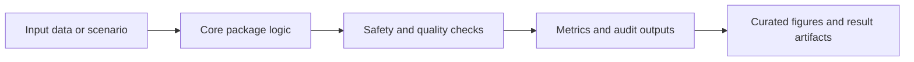

# SAFE-Gate

## Overview

Safety-first gated triage ensemble with conservative risk merging and formal safety checks.

This repository is part of an eight-repository clinical decision-support research portfolio. Current status: manuscript or component package in preparation. The repository role is **manuscript and supplementary**.

## Headline Results (deterministic, seed=42)

Reproduced end to end by `run_all.py` on the held-out 805-case test split:

| Result | Value |
|---|---|
| Critical-tier sensitivity (R1/R2) | 100.0% (175/175), 95% CI 97.9-100% |
| False discharges (true critical to R5) | 0 |
| False negative rate | 0.0% |
| Formal safety-property violations | 0 / 805 |
| Overall accuracy (ACWCM) | 29.9% |
| Discharge specificity (R5 recall, ACWCM) | 0.0% |
| Over-triage rate (ACWCM) | 42.2% |

The reproducible, defensible contribution is the formally guaranteed safety floor:
every truly critical case is kept at a critical tier with zero false discharges and
zero invariant violations. Conservative merging achieves this at the cost of high
over-triage (R2/R3/R5 are seldom assigned), so aggregate accuracy and discharge
specificity are low and are reported as such. Cohort: 6,400 cases (4,797 / 798 / 805
train / val / test), 52 clinical features. Full numbers and baseline comparison are
in `REPRODUCIBILITY.md` and `results/`.

### Reproduce the results

```bash
pip install -e .
python run_all.py        # regenerates data, runs SAFE-Gate + baselines, writes results/
```

## Standard Repository Layout

| Path | Purpose |
|---|---|
| `src/` | Package source code: `safe_gate` |
| `tests/` | Unit, smoke, and behavior checks |
| `scripts/` | Reproducibility and export scripts |
| `examples/` | Runnable examples and demonstrations |
| `figures/`, `visualizations/`, `outputs/`, `results/` | Generated visual and result artifacts |
| `data/`, `models/`, `evaluation/` | Dataset, model, and evaluation assets when used by this repo |
| `FIGURE_MANIFEST.csv` | Curated figure inventory for manuscript or component evidence |
| `pyproject.toml`, `setup.py`, `requirements.txt`, `pytest.ini` | Python package and test configuration |

## Architecture Flow



## Core Logic

- Evaluate six safety gates.
- Merge gate outputs conservatively.
- Generate risk tier and abstention decision.
- Export safety, baseline, and per-class figures.

## Key Formulas And Rules

- Merged risk: R = max(G1, G2, G3, G4, G5, G6)
- Abstention rule: abstain if uncertainty >= theta_u or data_quality < theta_q
- Safety certificate: valid if all gate invariants pass

## Data, Results, Charts, And Graphs

The curated visual set is controlled by FIGURE_MANIFEST.csv and currently lists **6** figure entries. The manifest links figure IDs, roles, source scripts, source data, captions, sections, timestamps, and export DPI.

| ID | Role | PNG | PDF |
|---|---|---|---|
| SAFE-F1 | manuscript | `evaluation\manuscript_figures\safety_performance.png` | `evaluation\manuscript_figures\safety_performance.pdf` |
| SAFE-F2 | manuscript | `evaluation\manuscript_figures\baseline_comparison.png` | `evaluation\manuscript_figures\baseline_comparison.pdf` |
| SAFE-F3 | manuscript | `evaluation\manuscript_figures\confusion_matrix.png` | `evaluation\manuscript_figures\confusion_matrix.pdf` |
| SAFE-F4 | manuscript | `evaluation\manuscript_figures\per_class_metrics.png` | `evaluation\manuscript_figures\per_class_metrics.pdf` |

## Reproduce

```powershell
cd D:\PhD-NU\Manuscript\GitHub\SAFE-Gate
python -m venv .venv
.\.venv\Scripts\Activate.ps1
pip install -e .
python -m pytest -q
```

If figure-generation scripts are present, run the matching script listed in `FIGURE_MANIFEST.csv` from the repository root.

## Verification Criteria

- Root metadata and package files are present.
- Source paths follow `src/<package>/...` where the package shape allows it.
- Tests pass with `python -m pytest -q`.
- Curated figures are listed in `FIGURE_MANIFEST.csv` rather than inferred from every raw image file.
- Manuscript status wording stays conservative: in preparation, implementation, supplementary, or reproducibility/component evidence as appropriate.
- No local manuscript path, external assistant wording, or software metadata block is kept in the repository text.

## Portfolio Relationship

| Repository | Role |
|---|---|
| BASICS-CDSS | Beyond-accuracy evaluation methodology |
| TRI-X | Framework-level package |
| ORASR | Routing and safety-action component |
| DRAS-5 | Dynamic risk-state component |
| SAFE-Gate | Safety-gated ensemble framework |
| SynDX | Synthetic validation and explainability evidence |
| SURgul | SRGL/governance reproducibility component |
| TRI-X-CDSS | Integration and implementation package |
| Selective-CDSS | Risk-controlled selective-prediction (abstention) component |
| Causal-CDSS | Causal-inference evaluation component |
| Beyond-Accuracy | Simulation-based safety/calibration evaluation framework |

## Contact

**Chatchai Tritham**  
Department of Computer Science and Information Technology, Faculty of Science, Naresuan University, Phitsanulok 65000, Thailand  
Email: chatchait66@nu.ac.th  
ORCID: 0000-0001-7899-228X

**Chakkrit Snae Namahoot**  
Department of Computer Science and Information Technology, Faculty of Science, Naresuan University, Phitsanulok 65000, Thailand  
Email: chakkrits@nu.ac.th  
ORCID: 0000-0003-4660-4590